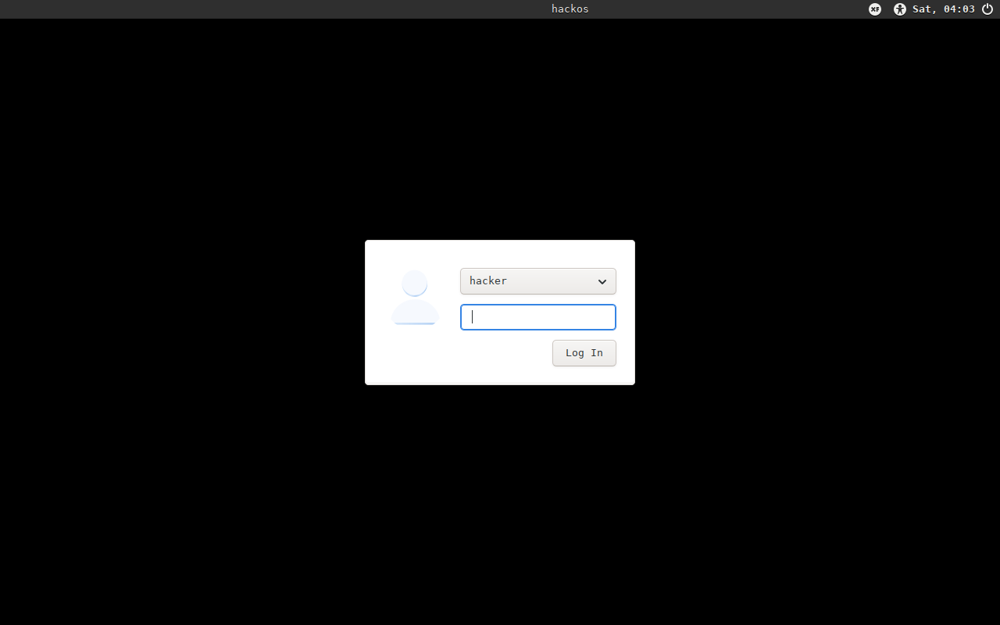
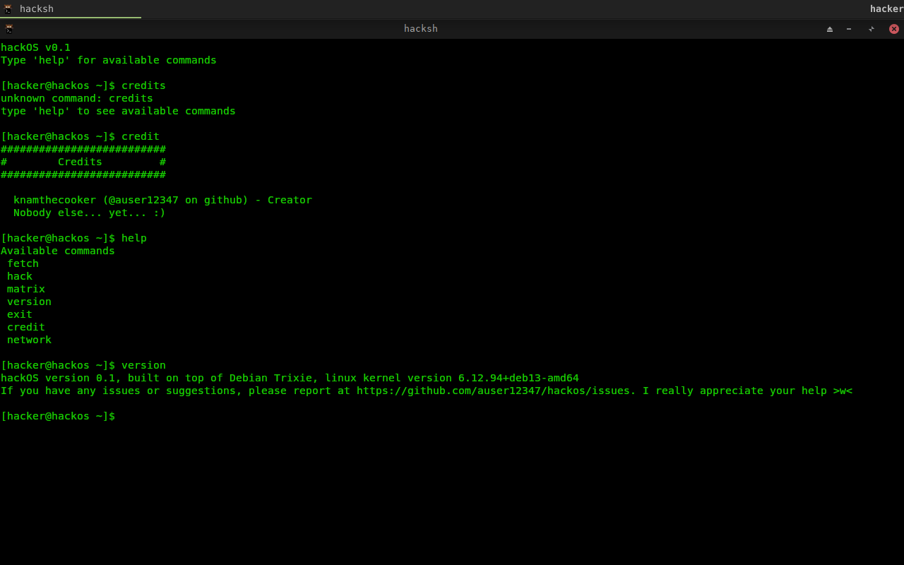
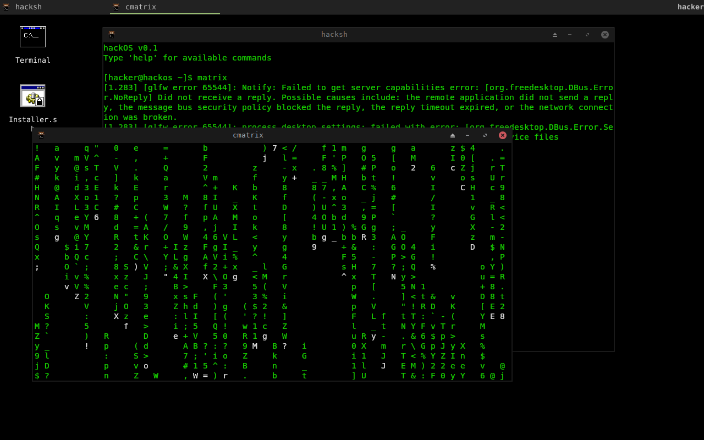
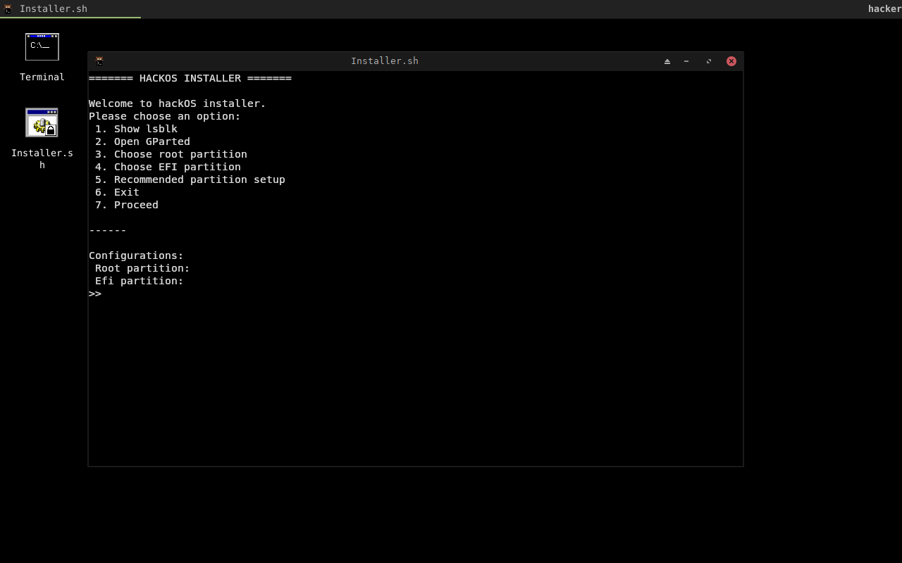

# hackOS
A joke distro I made for fun

## Table of contents
1. [About](#about)
2. [Warning](#warning)
3. [Screenshots](#screenshots)
4. [Features](#features)
5. [Device specifications](#device-specifications)
6. [Download and install](#download-and-install)

## About
hackOS is a joke distro which you can install to troll your friends, classmates, coworkers and even President Donald Trump 😂

## WARNING
This project is **NOT developed or maintained by certified professionals**. It is created purely as a hobby project and may contain bugs, missing features, or unfinished components.

It is **strongly recommended** to run this operating system inside a virtual machine only. It is **not designed for daily use or production environments**.

If you choose to install or use it on real hardware, you do so entirely at your own risk.

hackOS is **NOT affiliated with Debian or any of its official projects.**

## Screenshots
|  |  |
|---|---|
|  |  |

## Features
hackOS has its own "shell", which is called hacksh. It does not execute commands like most normal shells do, btw.

Right now, hackOS has only these available commands:
- `fetch`
- `hack`
- `matrix`
- `version`
- `command`
- `credit`
- `exit`

If you want to give some suggestions on new commands, please open a new issue.

## Device specifications 
If your computer works, this thing will work. Still, at least 1GB of RAM is recommended for a smooth experience.

An ideal partitioning setup looks like this:
- A GPT disk
- An EFI partition with at least 512MB (for EFI systems)
- A root (/) partition with at least 5GB

## Download and install
Download the ISO file at [this link](https://sourceforge.net/projects/hackosha/files/). Recommended choosing UEFI version.

You can either use the live version or install it on your computer using the `Installer.sh` on the desktop.
